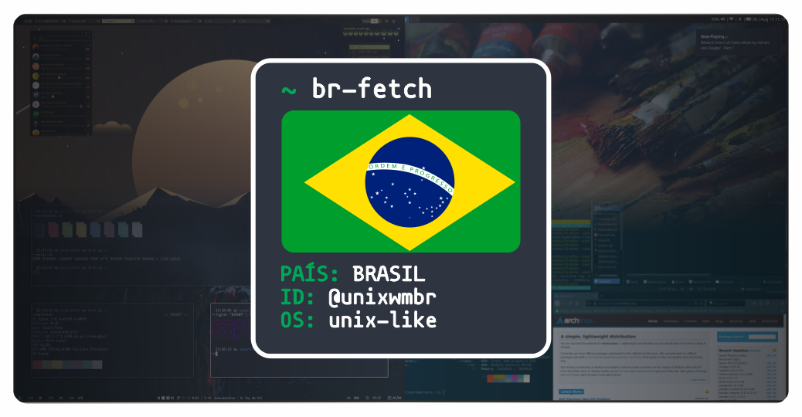

    
      
    <h3>Repositório de amostra de dotfiles do grupo Unixwmbr.</h3>

  

<h1 align="center">Dotfiles</h1>

- [i3 & i3-gaps](i3/README.md)
- [BSPWM](bspwm/README.md)
- [Sway](sway/README.md)

<h2 align="center">Contribuindo</h2>

Para adicionar sua configuração, você pode falar com o pessoal no [grupo do telegram](https://t.me/unixwmbr) e então fazer um Pull
Request, veja [CONTRIBUTING.md](CONTRIBUTING.md).
