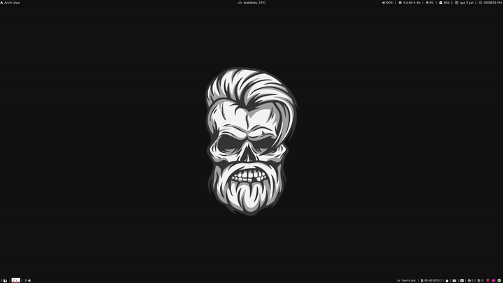

<h1 align="center">Scripts</h1>

  
    
  
Desenhe um terminal na tela (alacritty é o padrão).

  
    

---

  
    
  
Labels de janelas para polybar - bspwm/i3wm.

  
    

---

#### [Voltar para o README principal](https://github.com/unixwmbr/unixwmbr)
